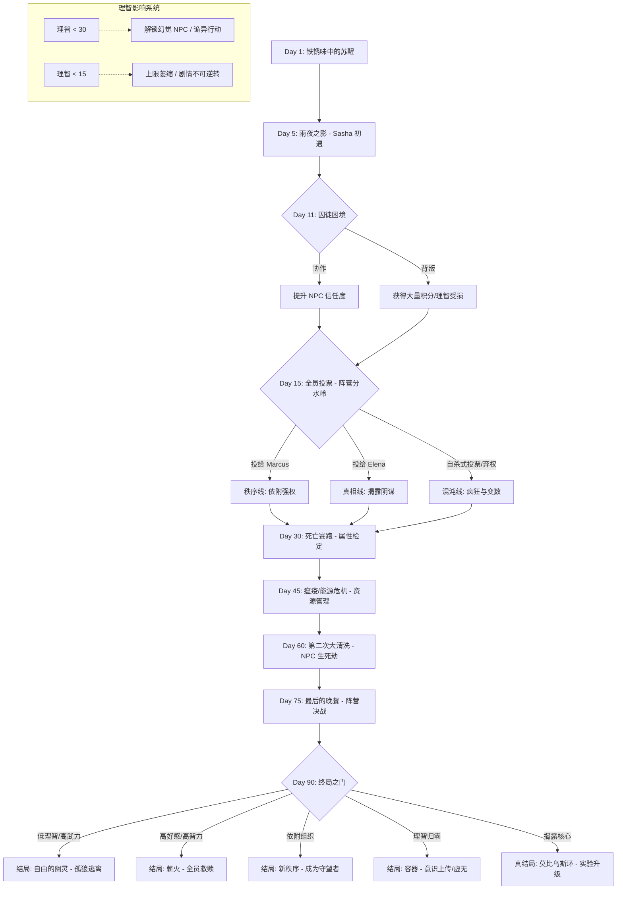

# 现代黑暗生存文字冒险 - 深度剧情大纲 (90天)

## 虚构世界观：穹顶之下
所有参与者均来自不同的“居住扇区 (Residential Sectors)”，被投放至名为“第零号回收场 (Salvage Zero)”的地下设施。

## 核心剧情流程图 (Mermaid)

## 90 天主线框架 (预留留白以便后期填充)

### 阶段一: 幸存者偏差 (Day 1 - 20)
- **重点**：建立规则感，引入疲劳与理智惩罚。
- **关键事件**：雨夜行窃 (Day 5)、囚徒困境 (Day 11)、全员投票 (Day 15)。
- **留白**：可挂载 3-5 个不同背景 NPC 的初遇支线（如 Satoshi 的电路板维修请求）。

### 阶段二: 道德的腐蚀 (Day 21 - 50)
- **重点**：资源极度匮乏，阵营对立尖锐化。
- **关键事件**：死亡赛跑 (Day 30)、黑市交易 (Day 40)。
- **留白**：预留“能源危机”事件包，玩家需要在修复供氧系统或保护个人物资间选择。

### 阶段三: 虚伪的自由 (Day 51 - 80)
- **重点**：开始触及“秩序之眼”的实验本质。
- **关键事件**：第二次大清洗 (Day 65)、Elena 的最后记录。

### 阶段四: 审判日 (Day 81 - 90)
- **重点**：多结局收敛。

## 核心 NPC 阵营分布
1.  **秩序派 (Order)**：
    - **Marcus T.**：暴力与规则的维护者。认为牺牲少数人保全大局是合理的。
2.  **真相派 (Truth)**：
    - **Elena V.**：冷酷的观察者。相信只有掌握数据和情报才能终结轮回。
    - **Satoshi K.**：底层技术支持，掌握出口后门的钥匙。
3.  **生存派 (Chaos/Neutral)**：
    - **Sasha P.**：游离在系统边缘，代表着纯粹的生存本能。
    - **Julian V.**：投机者，左右逢源。

## 理智值（Sanity）对剧情的深度干预
- **欺诈互动**：理智低时，日志中的提示可能不再真实（例如：提示某个 NPC 好感度上升，实际可能是在埋伏你）。
- **禁忌结局**：某些揭露世界观真相的特殊结局，仅能在“理智极低但智力极高”的情况下触发。
