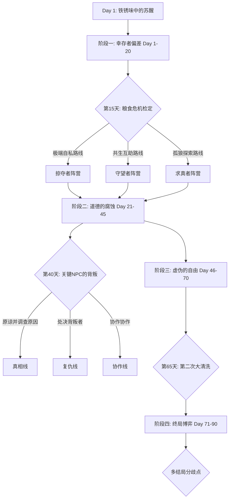

# 现代黑暗生存文字冒险 - 深度剧情大纲 (90天)

## 虚构世界观：穹顶之下
所有参与者均来自不同的“居住扇区 (Residential Sectors)”，被投放至名为“第零号回收场 (Salvage Zero)”的地下设施。

## 核心叙事架构：人性实验室
这里的“游戏”并非单纯的体能竞技，而是针对道德与逻辑的极端测试。神秘组织“秩序之眼 (Eye of Order)”通过 90 天的筛选，试图寻找某种能够“修正人类基因漏洞”的种子。

## 90 天主线框架 (预留大量留白以便后期填充)
- **阶段一: 破碎的记忆 (Day 1 - 20)**：侧重于适应环境。
  - *留白点 [Slot_A]*：可挂载 3-5 个不同背景 NPC 的初遇支线。
- **阶段二: 阵营博弈 (Day 21 - 50)**：侧重于社会结构重组。
  - *留白点 [Slot_B]*：预留“能源危机”或“瘟疫爆发”事件包。
- **阶段三: 真相的碎片 (Day 51 - 80)**：侧重于解密。
- **阶段四: 审判日 (Day 81 - 90)**：侧重于多结局收敛。

## 核心 NPC 群像 (虚构背景)
1.  **Elena V.**：来自“北境高塔”，追求真相的理性派。
    *   *冲突点*：她会要求你潜入危险区域寻找组织的名单。
2.  **Marcus T.**：来自“工业地带”，维持秩序的强权派。
    *   *冲突点*：他是“游戏日”的执法者，你必须在规则与人心间抉择。
3.  **Dr. Aris**：来自“中央学城”，怀有愧疚的技术派。
    *   *冲突点*：他秘密分发药物，但极度害怕被组织发现。
4.  **Satoshi K.**：来自“霓虹区”，试图技术突围的逃避派。
    *   *冲突点*：他掌握着突破物理封锁的关键，但极度胆小。

## 多结局预览
- **结局01: 自由的幽灵** - 独自逃离。
- **结局02: 薪火** - 牺牲自己拯救他人。
- **结局03: 新秩序** - 成为组织继承人。
- **结局04: 容器** - 发现自己是克隆体。
- **结局05: 寂静之声** - 全员死亡。
- **结局06: 莫比乌斯** - 发现外界也是实验室。
- (更多结局预留中...)
